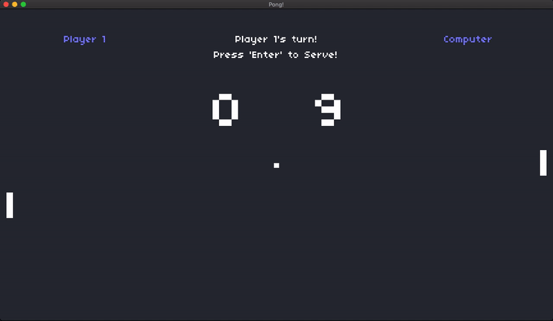

# Atari Pong

Atari Pong was the first commercially successful video game, and it helped to establish the video game industry along with the Magnavox Odyssey. It was manufactured by Atari and originally released in 1972.

This version is implemented in **Lua Programming Language** with **LÖVE**, inspired by the original game and the project created by [Colton Ogden](https://github.com/coltonoscopy).

---

### Run Instructions

1. Download and install [LÖVE framework](https://love2d.org/) on your system.
2. Clone this repository.
3. Drag-and-drop this repository folder onto the LÖVE program icon to run the game.

### Play Instructions

* **Player 1** (_Left_):
  * Press '**w**' to move left paddle up.
  * Press '**s**' do move left paddle down.

* **Player 2** (_Right_):
  * Press '**up arrow**' to move right paddle up.
  * Press '**down arrow**' to move right paddle down.

* **Computer** (_Right_):
  * Press '**p**' to toggle between **Computer** (_automatic_) or **Player 2** (_manual_).

### Documentation

* [Lua Programming Language](http://www.lua.org/)
* [LÖVE Documentation](https://love2d.org/wiki/love)

### References

* [Colton Ogden's Pong](https://github.com/games50/pong)
* [Wikipedia - Pong](https://en.wikipedia.org/wiki/Pong)
